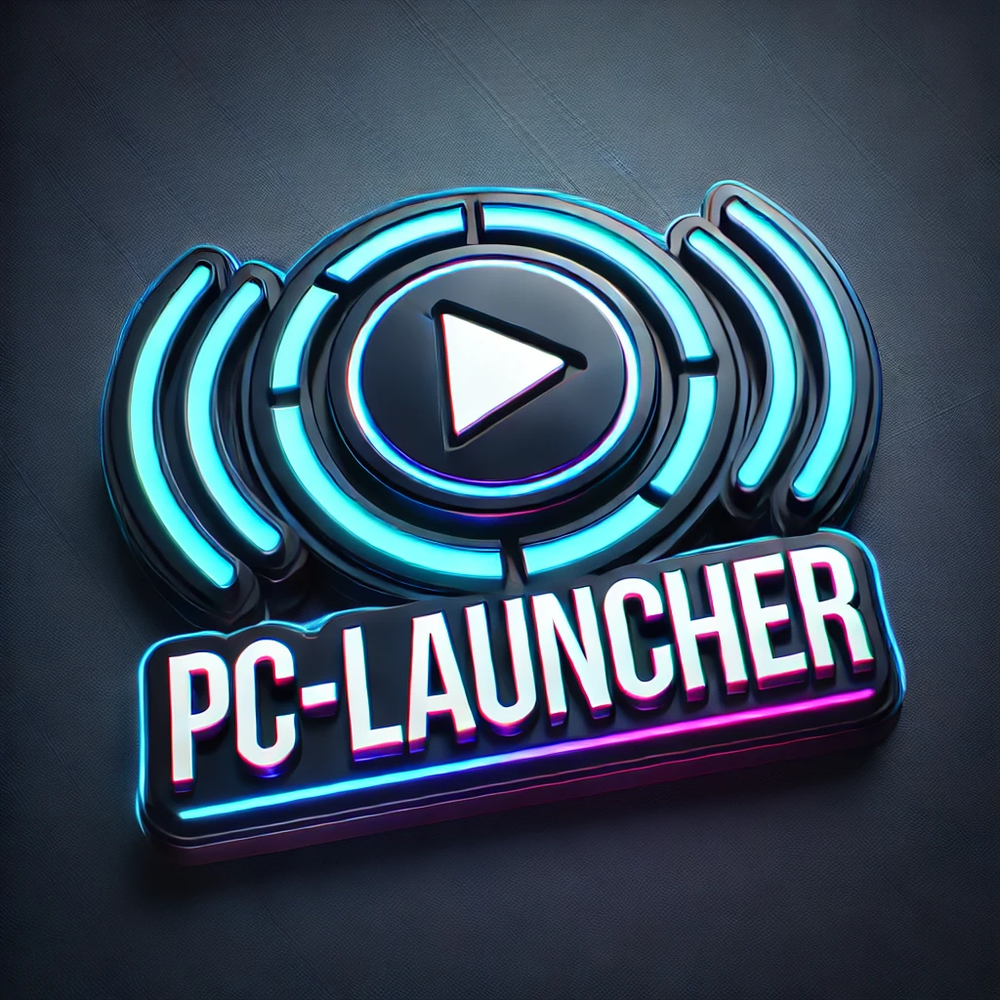
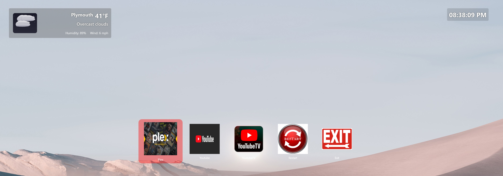
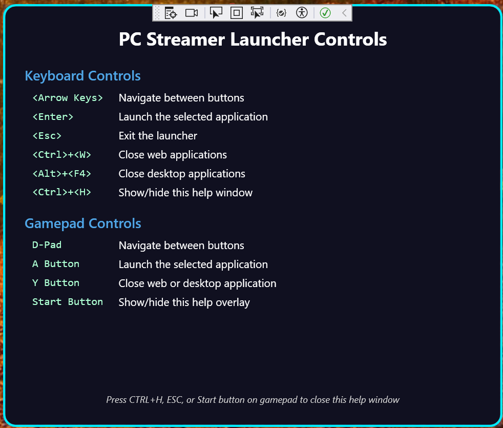
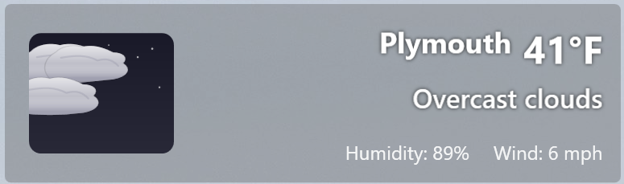

# PC-Launcher

<p align="center">
  
</p>

> **A streamlined media launcher for your big-screen PC experience.**

PC-Launcher is a lightweight, customizable desktop application designed to provide a seamless big-screen experience for launching media streaming services and local media players. Built with a focus on simplicity and reliability, it's perfect for home theater PC setups or any environment where you want a clean, controller-friendly interface.

## ✨ Features

- **Clean, Focused Interface** - Distraction-free design optimized for big screens and living room viewing distances
- **Multi-Platform Streaming** - Launch popular services like Netflix, Disney+, Hulu, YouTube TV, and more
- **Local Media Support** - Integration with media players like Plex HTPC
- **Gamepad Control** - Full gamepad/controller support with customizable button mapping
- **Keyboard Navigation** - Keyboard shortcuts for those who prefer traditional input
- **Weather Display** - Live weather conditions with beautiful visual effects
- **Bulletproof Focus** - Reliable window management that ensures applications properly gain focus
- **Sound Effects** - Audible feedback for navigation and application launching



## 📋 System Requirements

- Windows 10/11
- .NET Framework 4.8.1 or later
- Internet connection for streaming services
- Compatible game controller (optional)
- Weather API key (optional, for weather display)

## 🚀 Installation

1. **1. **Download** the [latest release](https://github.com/PC-Launcher/PC-Launcher/releases/download/v1.0.0/PC-Launcher.zip) or build from source
2. **Extract** the ZIP file to a location of your choice
3. **Configure** the `config.ini` file to set up your preferred streaming services and applications
4. **Run** `PC-Launcher.exe` to start the application

### File Structure

```
C:\PC-Launcher\
├── PC-Launcher.exe          # Main executable
├── config.ini               # Configuration file
├── nircmd.dll               # Required for system operations
├── Newtonsoft.Json.dll      # JSON handling
├── System.Reactive.dll      # Reactive extensions
├── Images\                  # App icons
│   ├── Netflix.png
│   ├── YouTube.png
│   ├── Plex.png
│   ├── Exit.png             # Required for Exit Button
│   ├── Restart.png          # Required for Restart Button
│   └── ...
├── Sounds\                  # Sound effects
│   ├── Launch.wav
│   ├── Navigate.wav 
│   ├── Return.wav
│   └── Startup.wav
└── Logs\                    # Application logs
```

## ⚙️ Configuration

PC-Launcher uses a `config.ini` file to store all settings. This file is divided into sections that control different aspects of the application.

### Weather Configuration

```ini
[Weather]
; Toggle weather rendering system
Enabled = true

; Location Settings
; LocationType can be one of: "zip", "city", or "coordinates"
LocationType = zip

; For ZIP code (US only)
ZipCode = 18651
CountryCode = US

; For city name (international)
;CityName = London
;CountryCode = GB

; For coordinates (international)
;Latitude = 51.5074
;Longitude = -0.1278

; The API Key for WeatherBit service
WeatherApiKey = your_api_key_here
; Display Settings
TemperatureUnit = F          ; F (Fahrenheit) or C (Celsius)
WindSpeedUnit = MPH          ; MPH or KPH
ShowConditionIcon = true     ; Show weather condition icon
UpdateFrequency = 15         ; Update interval in minutes
```

**Weather Behavior:**

- When `Enabled = false`:  
  The entire weather system is fully disabled:
  - No weather API calls are made
  - No temperature, conditions, or wind speed are fetched
  - No visual weather elements are rendered (sun, clouds, stars, moon, etc.)
  - The weather icon and text block are hidden in the UI
  - Animated weather effects are completely skipped

- When `Enabled = true` but the API key is missing or invalid:  
  - A fallback message appears ("Weather unavailable")
  - No animations or data are displayed
  - Logs will indicate the key is missing

- When `Enabled = true` and a valid API key is provided:  
  - Full weather system is enabled
  - Current conditions, temperature, humidity, wind speed, and visual effects are shown

**Note on WeatherBit API Key:**
To use the weather display feature, you need to obtain a free API key from [WeatherBit](https://www.weatherbit.io/):
1. Register for an account at [https://www.weatherbit.io/account/create](https://www.weatherbit.io/account/create)
2. After verification, go to your Dashboard and copy your API key
3. Paste the key into the `WeatherApiKey` field in the config.ini file
4. Free tier accounts allow up to 50 calls per day, which is sufficient for normal use

### Streaming Services Configuration

```ini
[Commands]
; For web-based streaming services, provide the URL
Netflix = https://www.netflix.com/browse
Disney+ = https://www.disneyplus.com/home
Hulu = https://www.hulu.com/welcome
YouTube = https://www.youtube.com/
YoutubeTV = https://tv.youtube.com/
; Add your own services here
```

### Local Media Players Configuration

```ini
[MediaPlayers]
; For local applications, provide the full executable path
Plex = "C:\Program Files\Plex\Plex HTPC\Plex HTPC.exe"
; Add your own media applications here
```

### Browser Configuration

```ini
[Browser]
; Path to browser executable
DefaultBrowserExecutable = "C:\Program Files (x86)\Microsoft\Edge\Application\msedge.exe"
DefaultBrowserProcess = msedge
; Alternative browser configuration
AlternateBrowserExecutable = "C:\Program Files\Google\Chrome\Application\chrome.exe"
AlternateBrowserProcess = chrome
; Select which browser to use: "edge" or "chrome"
DefaultBrowser = edge
; Delay before hiding launcher (milliseconds)
HideDelay = 1000
; Enforce focus behavior for browser windows
EnforceFocus = true
```

### Navigation Configuration

```ini
[Navigation]
; Choose your preferred navigation method
; Options: Keyboard, Gamepad
NavigationMode = Gamepad
```

### Gamepad Configuration

```ini
[Gamepad]
; Enable/disable gamepad support
Enabled = true
Sensitivity = 0.5

; BUTTON MAPPINGS
ActionButton = 0x1000    ; Cross (✕) on PlayStation / A on Xbox
TerminateButton = 0x2000 ; Circle (○) on PlayStation / B on Xbox
UpButton = 0x0001        ; D-Pad Up
DownButton = 0x0002      ; D-Pad Down
LeftButton = 0x0004      ; D-Pad Left
RightButton = 0x0008     ; D-Pad Right
StartButton = 0x0010     ; Options on PlayStation / Menu on Xbox
```

### Sound Configuration

### 🔉 Sound Effects Overview
PC-Launcher includes a set of built-in sound effects for navigation and interaction:

| Sound File         | When It's Played                       |
|--------------------|----------------------------------------|
| `Startup.wav`      | On application launch                  |
| `Navigate.wav`     | When navigating between app buttons    |
| `Launch.wav`       | When selecting/launching an app        |
| `Return.wav`       | When exiting PC-Launcher or returning  |

These sounds are stored in the `Sounds\` directory and can be replaced with your own `.wav` files using the same filenames.

> **Tip:** Keep sounds short and under 2 seconds for best responsiveness.

```ini
[Sound]
; Enable/disable sound effects
Enabled = true
```

## 🎮 Using PC-Launcher

### Navigation

PC-Launcher supports multiple navigation methods:

#### Mouse Control

PC-Launcher provides intuitive mouse interaction for users who prefer traditional pointer-based navigation:

- **Hover Effects**: When the mouse pointer moves over an application button, visual feedback immediately indicates that the button is interactive
- **Left Click**: Selects and activates an application button, launching the associated service or program with the same feedback as keyboard or gamepad activation
- **Focus Transfer**: Moving the mouse over a button automatically transfers visual focus, providing a seamless experience when switching between input methods
- **Accessibility**: Large button targets make mouse navigation comfortable even at living room distances
- **Sound Feedback**: Click actions trigger the same audio cues as other input methods, providing consistent feedback

Mouse interaction works alongside keyboard and gamepad controls without conflicts - the last used input method takes priority for focus management.

#### Keyboard Control

- **Arrow Keys**: Navigate between buttons
- **Enter**: Select/activate button
- **Escape**: Exit PC-Launcher
- **Alt+F4**: Close launched application
- **Ctrl+H**: Display help overlay

#### Gamepad Control

- **D-Pad**: Navigate between buttons
- **A/Cross (✕)**: Select/activate button
- **B/Circle (○)**: Close launched application
- **Start/Options**: Display help overlay

BUTTON MAPPINGS:
IMPORTANT: Values must be on a separate line from comments!
The format must be exactly: "UpButton = 0x0001" with no trailing text.
PlayStation DualShock/DualSense buttons:
ActionButton = 0x1000
TerminateButton = 0x2000
UpButton = 0x0001
DownButton = 0x0002
LeftButton = 0x0004
RightButton = 0x0008
StartButton = 0x0010

CONTROLLER REFERENCE (for information only):
PlayStation:                  Xbox:
Cross (✕) = 0x1000           A = 0x1000
Circle (○) = 0x2000          B = 0x2000
Square (□) = 0x4000          X = 0x4000
Triangle (△) = 0x8000        Y = 0x8000
D-Pad Up = 0x0001            D-Pad Up = 0x0001
D-Pad Down = 0x0002          D-Pad Down = 0x0002
D-Pad Left = 0x0004          D-Pad Left = 0x0004
D-Pad Right = 0x0008         D-Pad Right = 0x0008
Options = 0x0010             Start/Menu = 0x0010

#### Focus Management

PC-Launcher implements a robust focus system to ensure intuitive navigation across input methods:

- **Visual Indicators**: The currently selected button is highlighted with a distinct visual style, making it clear which application will launch when activated
- **Smart Grid Navigation**: The navigation system follows a logical grid pattern, allowing movement between buttons in all four directions (up, down, left, right)
- **Focus Preservation**: When returning to the launcher after closing an application, focus returns to the last selected button
- **Bulletproof Focus**: A sophisticated focus management system ensures reliable button selection even in complex desktop environments
- **Automatic Recovery**: If focus is lost for any reason, the system automatically recovers and restores proper focus
- **Input Method Switching**: Seamlessly switch between gamepad, keyboard, and mouse input - the system responds appropriately to each method

The focus system provides responsive visual and audio feedback when navigating between buttons, enhancing the user experience when browsing through available applications.

#### Help Overlay

PC-Launcher includes a built-in help screen that can be accessed at any time by pressing **Ctrl+H** on the keyboard or the **Start/Options** button on your gamepad. This overlay provides a quick visual reference of all available controls and navigation options.



### Launching Applications

1. Navigate to the desired service/application button
2. Press Enter (keyboard) or A/Cross (gamepad) to launch
3. PC-Launcher will minimize and the selected service will open in the foreground
4. To return to PC-Launcher, close the application or press Alt+F4 (keyboard) or B/Circle (gamepad)

### Weather Display

### Live Wallpaper Compatibility

PC-Launcher includes built-in compatibility with popular live wallpaper tools and shell environments, such as:

- **Wallpaper Engine**
- **RocketDock**
- **Progman** and **WorkerW** (standard Windows desktop)
- Other shell environments

The launcher sends restore messages to these windows to prevent visual conflicts and maintain proper window layering.

> No configuration is required — live wallpaper compatibility is automatic.


The weather display shows current conditions for your configured location:



- Current temperature
- Weather conditions (sunny, cloudy, rainy, etc.)
- Wind speed
- Animated weather effects that match current conditions including moon phase (all animation are rendered internal to the application

## 🎨 Customization

### Adding New Applications

To add a new application:

1. **Create an icon** - Create a square PNG image (256x256 recommended) and save it in the `Images` folder
2. **Add the command** - Open `config.ini` and add a new entry in the appropriate section:
   - For web-based services, add to the `[Commands]` section
   - For local applications, add to the `[MediaPlayers]` section
3. **Match the names** - The key in the config file must exactly match the image filename (without extension)

Example:
```ini
[Commands]
HBO = https://www.max.com/
```
With an image file: `Images/HBO.png`

### Icon Guidelines

- Create square PNG images (256x256 recommended)
- Use simple, recognizable designs
- Ensure high contrast for visibility on large screens
- Keep a consistent style across icons

## 🔍 Technical Features

### Focus Management

PC-Launcher implements a robust focus management system to ensure reliable application launching:

#### Launcher Focus

The `WindowFocusHelper` class manages focus for the launcher window, providing:

- Multiple focus methods for reliability
- Window restoration for minimized windows
- Focus recapture when returning from applications
- Desktop focus management

#### Web Application Focus

The `WebAppFocusHelper` implements "bulletproof focus behavior" for browser-launched applications:

- Uses Windows API to ensure browser windows gain focus
- Thread input attachment for reliable focus transfer
- Window restoration if minimized
- Configurable via the `EnforceFocus` setting

### Desktop Environment Compatibility

PC-Launcher is designed to work seamlessly with a variety of desktop environments and shell enhancements:

- Automatically notifies Windows desktop components and shell replacements
- Compatible with standard Windows desktop (Progman), shell components (WorkerW), dock applications (RocketDock), and live wallpaper tools (Wallpaper Engine)
- Ensures proper window layering and restoration when switching between applications
- No configuration required - compatibility is built-in

### Process Management

PC-Launcher carefully manages application processes:

- Proper application launching with command-line arguments
- Process monitoring to detect application termination
- Clean resource handling during shutdown
- Automatic focus restoration when processes exit

### Logging System

The application maintains detailed logs for troubleshooting:

- Rolling log files with automatic cleanup (7-day retention by default)
- Size-based log rotation (10MB default)
- Configurable log levels
- Context-specific logging for component isolation

Log files are stored in the `Logs` directory and follow the naming pattern `app_YYYYMMDD.log`.

## 🔧 Troubleshooting

### Common Issues

#### Application Doesn't Launch

- Check the executable path in `config.ini`
- Verify the application is installed
- Check the logs for specific error messages

#### Browser Doesn't Focus Properly

- Enable the `EnforceFocus` option in the `[Browser]` section
- Increase the `HideDelay` value to give more time for the browser to initialize
- Use a different browser in the configuration

#### Weather Not Displaying

- Verify your WeatherBit API key is correct
- Check your location settings
- Ensure you have an active internet connection
- Look for API errors in the log files
- If using free tier WeatherBit API, verify you haven't exceeded the daily limit (50 calls)
- Try switching the location type (between zip, city, or coordinates)

#### Gamepad Not Working

- Verify the controller is connected and recognized by Windows
- Check the button mappings in `config.ini`
- Ensure the `Enabled` setting is set to `true` in the `[Gamepad]` section

### Log Files

Logs are stored in the `Logs` directory and can be useful for diagnosing issues:

- Most recent log: `app_YYYYMMDD.log` (where YYYYMMDD is the current date)
- Archived logs: `Logs\Archive\app_YYYYMMDD_HHMMSS.log`

Common log entries to look for:

```
[Error] Error launching application: Process could not be started
[Warning] Browser window not found after launch
[Error] WeatherAPI: Failed to connect to service
```

## 🧠 Development Guide

### Project Structure

- **Services/** - Core services and business logic
  - `LauncherService.cs` - Main application launching logic
  - `ConfigParser.cs` - Configuration handling
  - `WeatherManager.cs` - Weather data and display
  - `GamepadHandler.cs` - Controller input management
  
- **Helpers/** - Utility classes
  - `WindowFocusHelper.cs` - Focus management for launcher
  - `WebAppFocusHelper.cs` - Focus management for web apps
  - `ProcessOperationHelper.cs` - Process handling utilities
  
- **UI Components**
  - `MainWindow.xaml` - Main application interface
  - `SplashWindow.xaml` - Startup splash screen
  
- **Resources**
  - `Images/` - Application icons and graphics
  - `Sounds/` - Sound effects

### Key Components

#### LauncherService

The central service responsible for:
- Application launching
- State management
- Focus coordination
- Process monitoring

#### Weather System

A modular weather display system with:
- API integration with WeatherBit
- Custom weather condition icons
- Animated weather elements
- Unit conversion support

#### Navigation System

Handles input from multiple sources:
- Keyboard mapping
- Gamepad integration
- Button focus management
- Input validation

## 🙏 Acknowledgments

This project was developed with assistance from:

- [Claude by Anthropic](https://claude.ai) - Documentation formatting, README structure, and code review
- [ChatGPT by OpenAI](https://chat.openai.com) - Development guidance and troubleshooting assistance

These AI assistants provided valuable input during the development process and helped shape the final product.

## 📜 Credits

PC-Launcher uses the following third-party components:

- NirCmd by NirSoft - For system operations
- Newtonsoft.Json - For JSON parsing
- System.Reactive - For reactive programming

### License

PC-Launcher is licensed under the MIT License. See the LICENSE file for details.

---

*PC-Launcher - Version 1.0.0 - Last Updated: April 2025*
